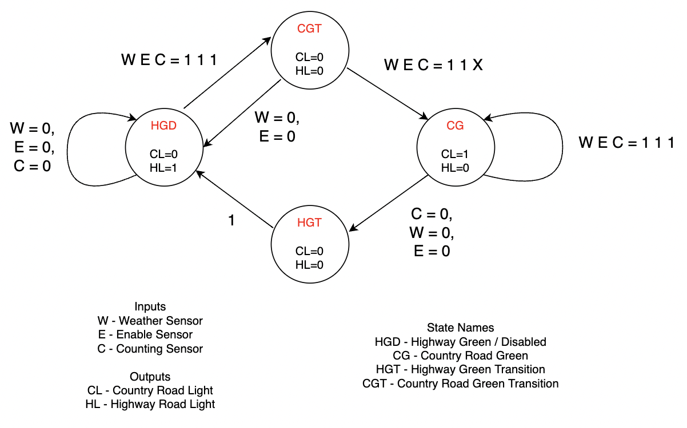
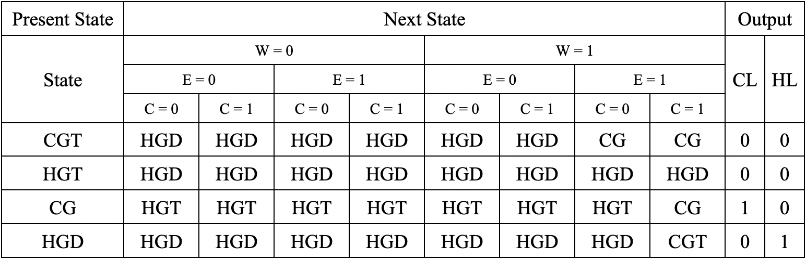
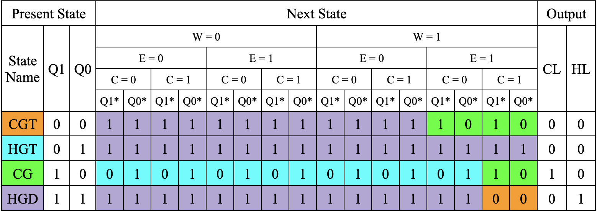
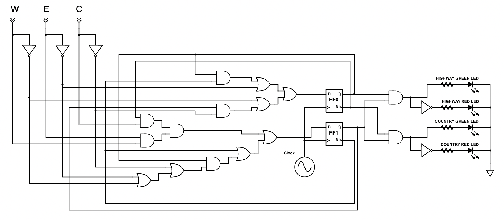
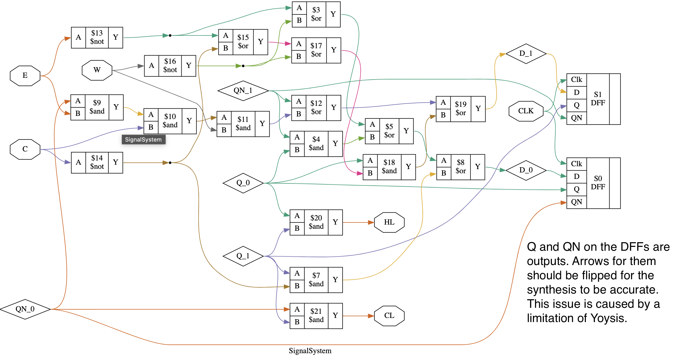
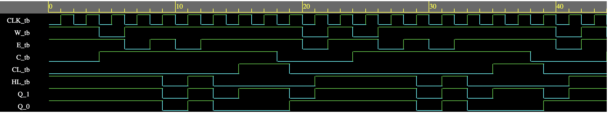

# Traffic Signal System

## Project Overview
This system is made to control 2 traffic signals at an intersection between a one-way country road and a one-way highway road. The design implements a counting sensor that counts the number of vehicles that crossed the intersection, a weather sensor that detects if it is snowing, and an enable sensor. 
<br>
<br>
The system has 2 outputs, 1 per traffic signal. The outputs are a 1 if the signal should be green and a 0 if it should be red. The counting sensor can be disabled by the enable sensor or the weather sensor. When it’s snowing the weather sensor will be a 0 which disables the counting sensor. Additionally, when the enable sensor is a 0, it also disables the counting sensor. The country road will have a red light and the highway road will have a green light when the counting sensor is disabled. 
<br>
When both the enable and weather sensors are 1, the counting sensor is enabled. When enabled, the counting sensor gives a bit that flips for every car that crosses the intersection. If the highway road signal is green, when the counter sensor hits 1, it switches the highway road signal to red and then the country road signal to green. If the country road signal is green, when the counter sensor hits 0, it switches to red and then the highway road signal switches to green. There is also a period where both signals are red between every signal change. Both signals are never green at the same time. 

 
## Concepts Used
Combination and Sequential Logic <br>
State Machine Creation <br>
D-Flip Flop Usage <br>
Karnaugh-Map Simplification <br>
System Verilog
* Continuous Assingment / Dataflow
* Procedural / Behavioral
* Instantiation
* Testbench Creation


## Tools and Resources
### Bill Of Materials
* 2 Red LEDs
* 2 Green LEDs
* Wires
* 1 Full Sized Breadboard
* 4 100 Ohm Resistors 
* 1 SN74HC04 chip
* 2 SN74HC08 chip
* 2 SN74HC32 chip
* 1 CD74HC175 chip
* 1 Counting Sensor
* 1 Weather Sensor
* 1 Enable Sensor / Switch
* 1 Clock

### Software Used
* EDA Playground
* IcarusVerilog 0.10.0
* Yoysy 0.9.0

### Equipment Used
* NI myDAQ

## Design

### State Diagram


### Considerations
One choice made was how the counter should affect the signals. One option was to make the signals switch back and forth everytime the counter was at 0. This caused an issue where if no cars cross the intersection and the counter is at 0, then the signals would switch back and forth in a loop. This can be fixed by adding 2 more states but by choosing the current design where the signals switch at different counting sensor inputs, 0 and 1 this issue is fixed. This solution is better because it keeps the design simple and cheap by only needing 2 flip flops. 
<br>
Another consideration was to have a separate disabled state. However, it was combined with another state to create the Highway Green/Disabled State (HGD). This is because their outputs are the same and they don’t need different transitions. This allowed for a simpler design because it only needs 2 flip flops. 
<br>
Another element of the design is to have 2 “transition” states named Country Green Transition (CGT) and Highway Green Transition (HGT). These states are there in order to have a temporary period where both signals are red. Although both of these states have the same output, they have different transitions with the HGT state exclusively leading to the HGD state and the CGT state leading to both the HGD state and CG state.
<br>
The Country Green State is also the only state that can’t transition directly into the disabled state because it needs both signals to temporarily be red. Therefore, when the counting sensor is disabled it goes through the Highway Green Transition state before it goes into the Highway Green/Disabled state.

### State Table


### State Assignments
Country Green Transition(CGT) - 00 <br>
Highway Green Transition(HGT) - 01 <br>
Country Green (CG) - 10 <br>
Highway Green/Disabled (HGD) - 11 <br>

### Transition Table and Equations

D1 = Q1' + Q0(E' + C' + W') + Q0'ECW  <br>
D0 = E' + W' + Q1'Q0 + Q1C'

### Output Equations
Country Light (CL) = Q1 * Q0' <br>
Highway Light (HL) = Q1 * Q0

### Schematic


### System Verilog
[SystemVerilog Design](SVFiles/design.sv)
```
//Name: Volodymyr Semenov
//Date Created: May 15
//Purpose: Signal State Machine
//Modules present: DFF, SignalSystem
//Date of last update: May 17


//D-Flip Flop Module to be used in the Signal System
module DFF(D, Clk, Q, QN);
  //Inputs
  input D, Clk;
  //Outputs
  output Q, QN;
  //Wires to hold Values
  reg Q, QN;
  
  //Sets initial flip flop value to 1
  initial
    begin
    Q <= 1;
    end
  
  //On Clock trigger updates Output Q
  always@(posedge Clk)
        Q <= D;
  
  //Sets output QN to the opposite of Q on every update of Q
  always@(Q)
    QN <= !Q;
endmodule


module SignalSystem(W, E, C, CLK, HL, CL);
  //Inputs
  input W, E, C, CLK;
  //Outputs
  output HL, CL;
  //Wires to Hold Inputs and Outputs of called Flip Flop Modules
  wire Q_0, QN_0, D_0;
  wire Q_1, QN_1, D_1;
  
  //Instantiates DFF twice for state storage
  DFF S0(.D(D_0), .Clk(CLK), .Q(Q_0), .QN(QN_0));
  DFF S1(.D(D_1), .Clk(CLK), .Q(Q_1), .QN(QN_1));

  //Continuous Assingment Statements for D-Flip Flop Inputs
  assign D_0 = ~E | ~W | (QN_1 & Q_0) | (Q_1 & ~C);
  assign D_1 = QN_1 | (QN_0 & E & C & W) | (Q_0 & (~E | ~C | ~W ));
  
  //Continuous Assingment Statements for both Outputs
  assign HL = Q_0 & Q_1;
  assign CL = QN_0 & Q_1;
endmodule

```
[SystemVerilog TestBench](SVFiles/testbench.sv)
```
//Name: Volodymyr Semenov
//Date Created: May 15
//Purpose: Signal State Machine Testing
//Modules present: SignalSystem_tb
//Date of last update: May 17

//SignalSystem Testbench Module
module SignalSystem_tb;
  //Reg to hold inputs
  reg W_tb, E_tb, C_tb, CLK_tb;
  //Wires for outputs
  wire HL_tb, CL_tb;
  //Call on SignalSystem Module
  SignalSystem SystemTest(.W(W_tb),.E(E_tb),.C(C_tb),.CLK(CLK_tb),.HL(HL_tb),.CL(CL_tb));
   
  //Sets initial Values
   initial
     begin
       W_tb = 1;
       E_tb = 1;
       C_tb = 0;
       CLK_tb = 0;
     end
  
  //Cycles through different States with 3 inputs
  //All Inputs present to improve readability
  always
    begin
      //Should Stay in State HGD
      #2 W_tb = 1; E_tb = 1; C_tb = 0;
      #2 W_tb = 0; E_tb = 1; C_tb = 1;
      #2 W_tb = 1; E_tb = 0; C_tb = 1;
      
      //Should transition to State CGT
      #2 W_tb = 1; E_tb = 1; C_tb = 1;
      
      //Should transition to State HGD
      #2 W_tb = 1; E_tb = 0; C_tb = 1;
      
      //Should transition to State CGT
      #2 W_tb = 1; E_tb = 1; C_tb = 1;
      
      //Should transition to and stay in State CG
      #2 W_tb = 1; E_tb = 1; C_tb = 1;
      #2 W_tb = 1; E_tb = 1; C_tb = 1;
      
      //Should transition to State HGT
      #2 W_tb = 1; E_tb = 1; C_tb = 0;
      
      //Should transition to State HGD
      #2 W_tb = 0; E_tb = 0; C_tb = 0;     
    end
  
  //Cycles Clock
  always
    begin
      #1 CLK_tb = 1;
      #1 CLK_tb = 0;
    end
  
  //Setup Waveform
  initial
    begin
      //Creates File
      $dumpfile("DFFTest.vcd");
      //Dumps Variables
      $dumpvars;
    end
  
  initial
    begin
      //Seperates from warnings
      $display("----------------- Results -----------------");
      //Shows Inputs
      $display("CLK\tW\tE\tC\tHL\tCL");
      //Watches inputs and prints a new line every time inputs changes
      $monitor("%d\t%d\t%d\t%d\t%d\t%d",CLK_tb,W_tb, E_tb,C_tb,HL_tb, CL_tb);
    end
  
  //Ends the testbench after 2 input cycles
  initial
    #44 $finish;
  
  endmodule

```
## Testing Guidelines
### Physical Implementation
To test the physical system, observe how the system responds when the inputs are manually switched. Throughout the testing, make sure to check that both lights are never green at the same time, and check that there is a period where both lights are red between transitions from states where a signal is green. Start by checking that at every state, whenever the weather sensor or the enable sensor changes to 0, the system goes to the disabled state where the country road has a red light. You can identify which state the system is in based on which lights are currently on and which lights were on in the previous state. Lastly, check that as the counting sensor switches between 1 and 0, the road that has the green light switches correctly. 

### SV Testing
To test the System Verilog, start by running the testbench and opening the waveform. In the waveform, add all the testbench variables and the non-inverted flip flop outputs which show the state. Then looking at the waveform and transition table, check that for every input and current state that the next state is correct. To view the next state, look ahead in the waveform. Afterward, check that the outputs on the waveform match the transition tables outputs for every state.


## Synthesis Results



## Simulation Results

```
----------------- Results -----------------
CLK	W	E	C	HL	CL
0	1	1	0	1	0
1	1	1	0	1	0
0	1	1	0	1	0
1	1	1	0	1	0
0	0	1	1	1	0
1	0	1	1	1	0
0	1	0	1	1	0
1	1	0	1	1	0
0	1	1	1	1	0
1	1	1	1	0	0
0	1	0	1	0	0
1	1	0	1	1	0
0	1	1	1	1	0
1	1	1	1	0	0
0	1	1	1	0	0
1	1	1	1	0	1
0	1	1	1	0	1
1	1	1	1	0	1
0	1	1	0	0	1
1	1	1	0	0	0
0	0	0	0	0	0
1	0	0	0	1	0
0	1	1	0	1	0
1	1	1	0	1	0
0	0	1	1	1	0
1	0	1	1	1	0
0	1	0	1	1	0
1	1	0	1	1	0
0	1	1	1	1	0
1	1	1	1	0	0
0	1	0	1	0	0
1	1	0	1	1	0
0	1	1	1	1	0
1	1	1	1	0	0
0	1	1	1	0	0
1	1	1	1	0	1
0	1	1	1	0	1
1	1	1	1	0	1
0	1	1	0	0	1
1	1	1	0	0	0
0	0	0	0	0	0
1	0	0	0	1	0
0	1	1	0	1	0
1	1	1	0	1	0
0	0	1	1	1	0
```

## Reccomendations for Improvement
One improvement would be to change the counting sensor. This wouldn’t even affect the construction of the rest of the state machine. If the counting sensor switches bits after a higher number of cars pass, then the system would switch signals less often which would decrease the amount of time both signals are red and would improve traffic flow. <br>
The counting sensor can also be adjusted to switch at different amounts of cars that cross depending on the road. For instance, 4 cars passing on the highway could cause it to switch bits and 1 car passing on the country road could cause it to switch bits. This would balance the traffic flow because more cars are going to be driving on the highway than on the country road. <br>
Another improvement that could be made would be adding a time sensor or a time element to the design. The lack of a time element would cause issues when one road has very few cars driving on it. If, for instance, the country road is empty, then the highway will be stuck on a red light and more and more cars would be waiting for the light to switch. 


## References and Resources
* Digital Design: Principles and Practices, 5th Edition by John F. Wakerly
* CSE 241 Lecture Slides by Jennifer Winikus

This project was designed and implemented by Volodymyr Semenov in Spring 2022 for CSE241 at the University at Buffalo. Content in this repository is not to be reproduced or utilized without written authorization from the instructor, Dr. Winikus (jwinikus@buffalo.edu). 
